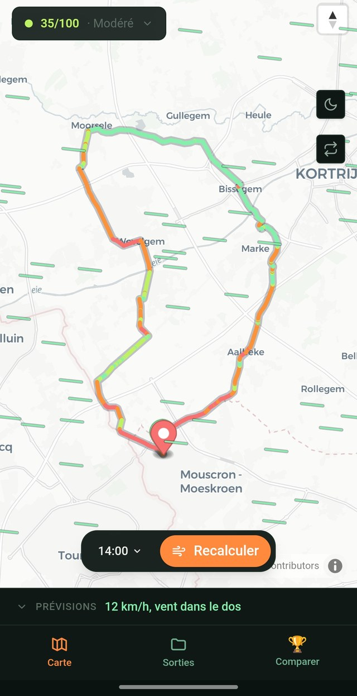
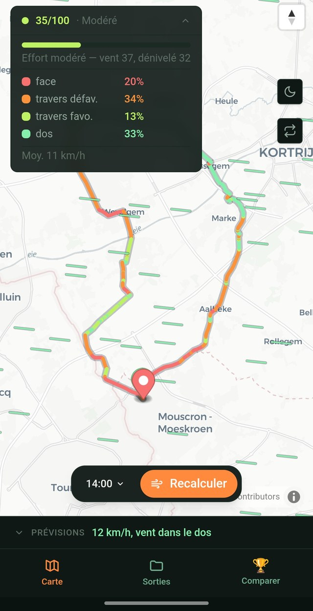
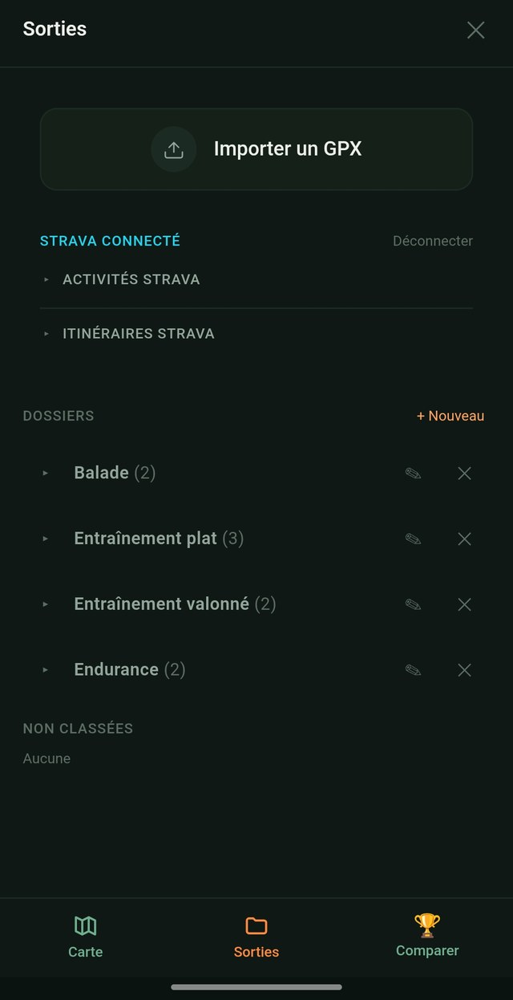
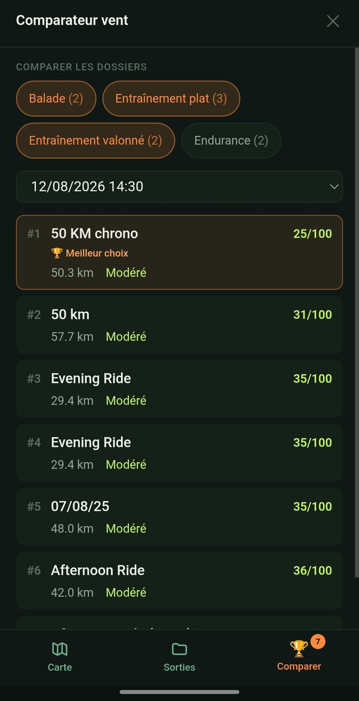

<div align="center">

# 🌬️ GPX Manager

**Ne pars jamais face au vent sans le savoir.**

Planification de sorties vélo qui calcule le vent réel, point par point, le long de ton tracé.

[**Ouvrir l'app**](https://gpxmanager.vercel.app) · [Présentation](https://gpxmanager.vercel.app/presentation) · [Tuto](https://gpxmanager.vercel.app/tuto)

</div>

<br/>



## Ce que ça fait

GPX Manager importe un tracé (fichier `.gpx` ou activité/itinéraire Strava) et calcule, pour chaque point du
parcours, si le vent y souffle de face, dans le dos, ou de travers, à l'heure de départ choisie. Un score d'effort
combine vent et dénivelé pour donner une idée réelle de la difficulté de la sortie.

| | |
|---|---|
|  | **Vent sur le tracé.** Le parcours se colore en rouge (face), vert (dos) ou orange (travers), recalculé à chaque changement d'heure. Un score d'effort sur 100 combine vent et dénivelé. |
|  | **Dossiers.** Range tes imports GPX et tes activités/itinéraires Strava par type de sortie : balade, entraînement, endurance. |
|  | **Comparateur.** Sélectionne un ou plusieurs dossiers, l'app classe tous les parcours qu'ils contiennent du vent le plus favorable au moins favorable, à l'heure choisie. |

## Stack technique

- **[React 19](https://react.dev)** + **TypeScript**, bundlé avec **[Vite](https://vite.dev)**
- **[Tailwind CSS v4](https://tailwindcss.com)** pour le style
- **[Zustand](https://zustand-demo.pmnd.rs)** pour l'état applicatif
- **[MapLibre GL](https://maplibre.org)** pour la carte, fonds [CARTO](https://carto.com) / [OpenStreetMap](https://www.openstreetmap.org)
- **[Open-Meteo](https://open-meteo.com)** pour les prévisions de vent et les horaires de lever/coucher du soleil
- **IndexedDB** (via [`idb`](https://github.com/jakearchibald/idb)) pour la persistance : tout reste en local, dans le navigateur, sans base de données serveur
- **API Strava** (OAuth) via des fonctions serverless **[Vercel](https://vercel.com)**, pour importer directement ses activités et itinéraires

Aucun compte à créer. Aucune donnée personnelle stockée côté serveur : le détail est sur la
[page confidentialité](https://gpxmanager.vercel.app/confidentialite).

## Développer en local

```bash
git clone https://github.com/Elios-Tech7700/gpxmanager.git
cd gpxmanager
npm install
```

L'intégration Strava passe par des fonctions serverless Vercel. Le développement local utilise donc `vercel dev`
plutôt que `vite dev` seul, pour émuler ces fonctions :

```bash
npx vercel login
npx vercel link
npm run dev          # équivaut à `vercel dev --listen 5173`
```

Pour tester la connexion Strava en local, il faut créer une [application Strava](https://www.strava.com/settings/api)
et renseigner `VITE_STRAVA_CLIENT_ID` / `STRAVA_CLIENT_SECRET` dans les variables d'environnement Vercel du projet
(jamais commitées, voir `.env.example`).

```bash
npm run build   # tsc -b && vite build
npm run lint     # oxlint
```

## Structure du projet

```
src/
├── components/     # UI React (carte, dossiers, import, comparateur…)
├── lib/             # Logique métier pure (calcul du vent, parsing GPX, Strava)
├── store/           # État Zustand (activités, dossiers, filtre du comparateur)
└── types/           # Types partagés
api/
└── strava/          # Fonctions serverless Vercel, proxy OAuth Strava
public/
├── presentation/    # Page publique de présentation
├── tuto/            # Guide d'utilisation
└── mentions-legales, confidentialite, cgu/   # Pages légales
```

## Licence

[MIT](LICENSE), © 2026 Hippolyte Bernière (Elios Group)
